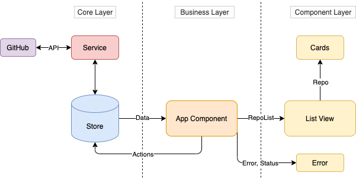

# Trending Repos

Trending Repos is a simple web application that makes use of the GitHub
API to display the most recently created repositories that have the 
highest stars. The application also uses a dynamic loading feature where
more repositories are fetched when scrolling to the bottom of the website.
The user can also visit the repository by clicking on the repository name.

[Live Demo](https://hrishikeshpaul.github.io/trending-repos/)

## How to run

- Requirements
  - NPM
  - Angular CLI

- Clone the repository on your local system
   ```shell
   $ git clone https://github.com/hrishikeshpaul/trending-repos.git
   $ cd trending-repos
   ```

- Start development server
   ```shell
   $ npm install
   $ ng serve -o 
   ```

- Code formatting

  ```shell
  $ ng lint --fix
  ```

- For production
  ```shell
  $ ng deploy --base-href=https://<username>.github.io/trending-repos/ --name=<name> --email=<email>
  ```

## Documentation

### Packages
- **Angular 9**: Front-end framework
- **NGXS**: State management
- **Bootstrap**: Styling library
- **MomentJS**: Date formatting
- **AOS**: Animations

### Workflow

#### State Management (Core Layer)

The application makes use of a state management system which keeps track of 
  - the data fetched from GitHub, 
  - the page number, 
  - whether the data is being fetched (loading)
  - and the errors (if any)

This interacts with the Repo Service which makes interacts with the backend (GitHub) via the mentioned API. It also uses an URL builder function that takes in the last 30 day's date and the page number for the API's query parameters.

#### App (Business Layer)

This specifies how the data should be used, and when the data
should be brought in from the state manager. It also maintains a scroll watcher to fetch the data with the next page number once the scroll bar has reached the bottom (by perfoming an action). Lastly, it observes the status, errors and the data and passes it on to the next layer. Therefore, this maintains an unidirectional flow of data.

#### Dumb Components (Component Layer)

The application makes use of 2 dumb componenets - list and repo-card. These componenets are purely defined by their inputs and does not depend on each other. This keeps the code modular and testing/debugging can be simpler. The list component accepts data from the App component and passes each data object (repository data in this case) to the card. 

Diagram below depics the workflow,




### Components

### App Component

- Wrapper component that houses the list and the error components.
- Passes data to the respective components.
- Watches for changes in the data and interacts with the store via actions.
- Watches scroll position for dynamic loading of data.

#### List Component

- Recieves the list of repositories from the App Component. 
- Creates multiple cards and passes on each data object to the cards.

#### Repo-card Component

- Recives a repository object shown below
  ```ts
  interface Repo {
    name: string;
    url: string;
    owner: string;
    owner_url: string;
    avatar: string;
    description: string;
    stars: number;
    issues: number;
    created: string;
    idx: number;
  }
  ```
- Displays the data in the format mentioned in the mock-ups.

#### Error Component

- Recives the status and error object, if any, shown below
  ```ts
  interface Error {
    message?: string;
    statusText?: string;
    troubleshooot?: string;
  }

  ```
- Tries to give the user some clues as to where one can find 
more information about the error.

### Services

#### Repo Service

- Makes an API call to the GitHub API to retrieve the data.
- Creates an URL that uses the last 30 day's date and page number to retrive the data.
- Receives data in the format mentioned below,
  ```ts
  interface GHResponse {
    total_count: number;
    incomplete_results: false;
    items: Array<any>;
  }
  ```
- Throws an error if the request fails.

### Store

#### Actions

- Action to fetch all repositories for a given date and page number.

  ```ts
  class FetchAllRepos {
    static readonly type = '[REPO] Fetch All Repos';
  }
  ```

- Once called, sets the value of `isLoading` to true and makes the API call through the Repo Service.
-  Udpates the state with the newly arrived data or updates the error state with the error.

#### State

- Maintains a central repository of various fields
  ```ts
  interface RepoStateModel {
    repoList: Repo[];
    pageNumber: number;
    loading: boolean;
    status: number;
    error: Error;
  }
  ```

#### Selectors

Return observables of the data or object so that the data can be consumed by the components.

- *getState*: Returns the current state.
- *getRepoList*: Returns the currently stores repo list.
- *isLoading*: Returns the value of `isLoading`.
- *getStatus*: Returns teh current status.
- *getError*: Returns the error object.


### Helper Function

#### function URL(date: string, page: number) 
- Accepts the last 3 days date and page number and returns an URL with the mentioned query parameters.


